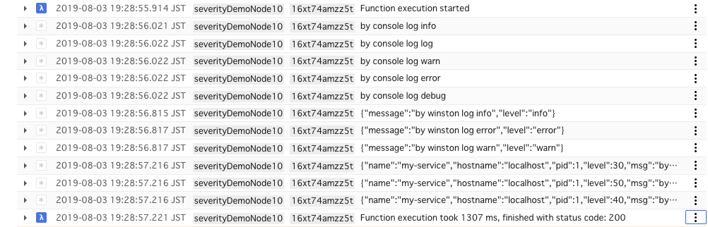

# Stackdriver serverity demo

A demo for severity of logs in Stackdriver Logging.

## Build

First build typescript.

```
yarn build
```

## Deploy

Then deploy to your runtime.

```
yarn deploy:node10
```

## Run

If you deploy `node10js` runtime call by this command.

```
gcloud functions call severityDemoNode10 --region=asia-northeast1
```

## Image



## Author 

* KeisukeYamashita